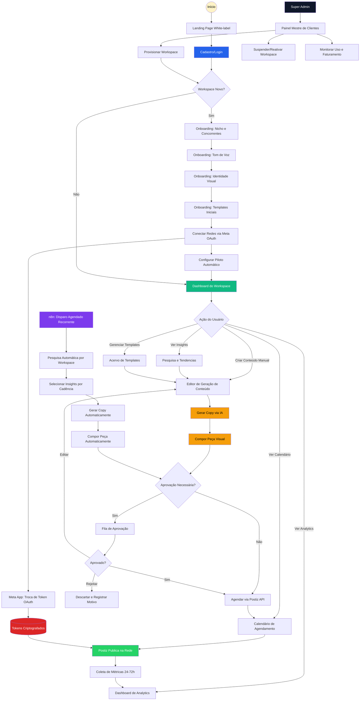
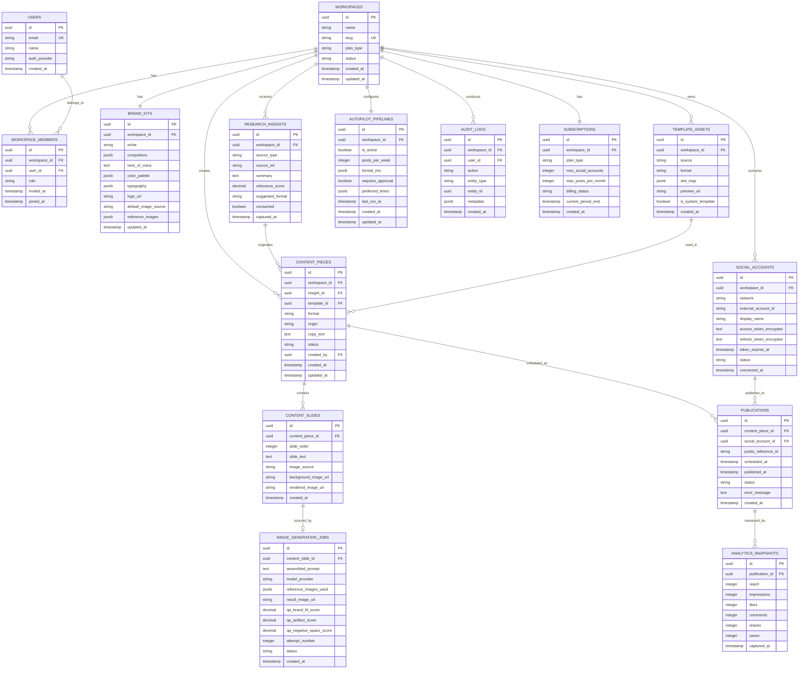
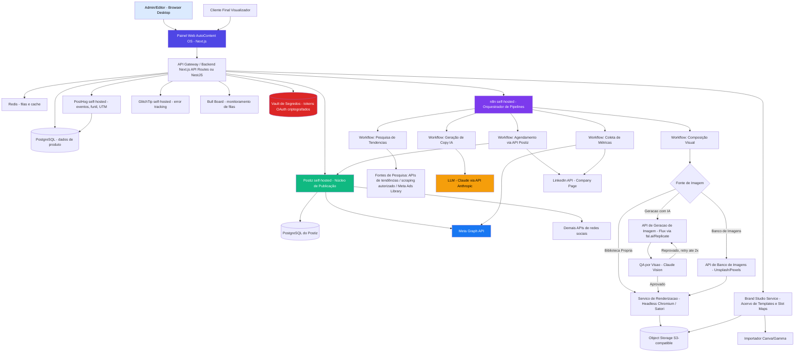

# PRD — AutoContent OS

> **Nome provisório.** "AutoContent OS" é um codinome de projeto/engenharia — o nome comercial/white-label final (o que o cliente final vê) fica a critério da marca de cada revenda. Ajuste livremente antes do lançamento.

## 1. Visão Geral

O **AutoContent OS** é uma plataforma white-label de automação de redes sociais que executa, sozinha, o ciclo completo que hoje consome o tempo de um social media ou de uma agência inteira: pesquisar o que está viralizando e o que os concorrentes estão fazendo, escrever roteiros e copies com voz própria, montar posts estáticos e carrosséis com a identidade visual do cliente, agendar e publicar nas redes certas — e repetir esse ciclo indefinidamente, sem intervenção humana, uma vez configurado. O problema que resolve é duplo: de um lado, agências e negócios que gerenciam redes sociais gastam a maior parte do tempo em trabalho operacional repetitivo (pesquisar referências, escrever variações de copy, montar arte no Canva, agendar manualmente) em vez de estratégia; de outro, a qualidade e a frequência de publicação caem justamente quando o negócio cresce e não há capacidade humana para sustentar o ritmo que as redes exigem para gerar alcance. O AutoContent OS entrega uma "equipe de social media autônoma": configura-se a marca uma vez (identidade visual, tom de voz, nicho, concorrentes) e o sistema pesquisa, cria, agenda e publica sozinho, com pontos de controle opcionais para quem quiser aprovar antes de ir ao ar.

O sistema funciona como uma composição de camadas que se conectam por um pipeline orquestrado. Primeiro, um **motor de inteligência de conteúdo** varre tendências, concorrentes e conteúdo viral do nicho do cliente e produz "insights acionáveis" (temas, formatos, ganchos que estão performando). Esses insights alimentam um **motor de geração de copy**, que escreve roteiros, legendas e textos de carrossel na voz configurada da marca — não um texto genérico de IA, mas copy calibrado por exemplos, tom e restrições daquela marca específica. O texto gerado é então encaixado em um **motor de composição visual**, que aplica esse conteúdo sobre templates de um acervo (padrões prontos do sistema, ou templates que o próprio cliente trouxe do Canva/Gamma) já adaptados à paleta, tipografia, logo e imagens da marca, produzindo posts estáticos e carrosséis prontos para publicar. O resultado passa por um **motor de agendamento e publicação** — construído sobre o Postiz, projeto open source já maduro para publicação multi-rede — que agenda e publica nos horários ideais em **Instagram, Facebook e LinkedIn**, as três redes contempladas no MVP, cada uma com suas particularidades de formato respeitadas (ex: carrossel do LinkedIn é tecnicamente um documento PDF multi-página, diferente do carrossel de imagens do Instagram/Facebook). Todo esse ciclo pode rodar em **modo piloto automático**: uma vez configurado o nicho, a marca e a cadência desejada, o pipeline se repete sozinho (pesquisa → geração → composição → aprovação opcional → agendamento → publicação → leitura de resultados → ajuste), fechando um loop que aprende com o que performou melhor. Uma camada de **analytics** consolida o desempenho de cada post, rede e cliente em um painel único, e uma camada de **administração multi-tenant** permite operar dezenas de marcas/clientes isolados entre si, com o revendedor (agência ou o próprio dono do produto) enxergando todos a partir de um painel mestre.

O **público-alvo primário** são agências de marketing e social media boutique que gerenciam redes sociais de múltiplos clientes e querem escalar o número de contas atendidas sem escalar proporcionalmente a equipe — hoje, cada conta nova exige um social media dedicado ou boa parte do tempo de um. Essas agências têm conhecimento de marketing mas pouco tempo/orçamento para construir automação própria, e usam hoje uma colcha de retalhos de ferramentas manuais (Canva, planilhas, agendadores desconectados, ChatGPT copiado e colado). O **público secundário** são negócios que gerenciam a própria marca e querem terceirizar 100% a operação de social media para uma ferramenta — donos de negócio sem social media dedicado, que hoje simplesmente não publicam com constância porque não têm tempo. Para ambos, a dor concreta é a mesma: a distância entre "sabemos que precisamos postar bem e com frequência" e "não temos capacidade operacional para sustentar isso".

Os principais diferenciais do AutoContent OS são: **1. Ciclo completo fechado**, do research à publicação, sem depender de outra ferramenta no meio do caminho; **2. Branding real, não genérico**, porque cada peça gerada nasce a partir do acervo de templates e do brand kit daquele cliente específico — cor, tipografia, logo e voz aplicados automaticamente em cada peça; **3. Compatibilidade com o fluxo criativo existente**, já que aceita templates trazidos do Canva e do Gamma em vez de forçar o cliente a recriar tudo do zero num editor próprio; **4. Piloto automático real**, com o pipeline pesquisa→cria→agenda→publica rodando em background de forma recorrente e configurável, não apenas geração de conteúdo sob demanda; **5. Arquitetura white-label e leve**, construída sobre componentes open source já maduros (Postiz para publicação, n8n para orquestração) rodando em VPS de baixo custo, permitindo revender a solução com margem saudável mesmo em planos de entrada; e **6. Produto pronto para vender sozinho (PLG)**, com onboarding guiado, central de ajuda com chat de IA, changelog público e uma interface consistente o suficiente para converter trial em pago sem depender de vendedor — sustentado por um Admin com controle total (incluindo os prompts da própria IA) e visibilidade completa de onde cada cliente trava no funil, para melhorar o produto continuamente em vez de só reagir a suporte.

---

## 2. Funcionalidades

### 2.1 Perfis de Usuário

| Perfil | Registro | Permissões | Acessos Principais |
|---|---|---|---|
| **Super Admin (Operador da Plataforma)** | Conta interna, criada manualmente na infraestrutura. | Controle total sobre todos os workspaces/clientes: criar, suspender, ver uso e faturamento, configurar limites de plano, acessar suporte técnico de qualquer workspace, editar prompts globais da IA, gerenciar conteúdo da central de ajuda/changelog, ver saúde do sistema e funil de conversão. | Painel Mestre de Clientes, Faturamento Global, Configurações de Infraestrutura, Logs de Auditoria Globais, Prompts do Sistema, Saúde do Sistema, Funil & UTM, Central de Ajuda (gestão de conteúdo). |
| **Admin do Workspace (Dono da Marca/Cliente)** | Convite do Super Admin ou autocadastro (se venda self-service estiver habilitada), e-mail + senha ou Google OAuth. | Controle total sobre o próprio workspace: brand kit, acervo de templates, pipelines de piloto automático, contas conectadas, aprovação de conteúdo, billing do próprio plano, convite de membros. | Dashboard, Brand Kit, Acervo de Templates, Pesquisa & Tendências, Geração de Conteúdo, Fila de Aprovação, Calendário, Conexões, Analytics, Configurações. |
| **Editor/Aprovador** | Convite do Admin do Workspace por e-mail. | Pode gerar e editar conteúdo, aprovar ou rejeitar peças na fila, reagendar posts. Não acessa billing nem configurações de conta/integrações sensíveis. | Dashboard, Geração de Conteúdo, Fila de Aprovação, Calendário, Analytics (leitura). |
| **Visualizador (Cliente Final do Cliente)** | Convite do Admin do Workspace, acesso somente leitura via link/login simplificado. | Apenas visualização do calendário de posts agendados/publicados e do dashboard de analytics. Não pode editar, aprovar ou publicar. | Dashboard (somente leitura), Calendário (somente leitura). |

### 2.2 Módulos do Sistema

1. **Autenticação & Multi-tenant (Workspaces)** — Login via e-mail/senha e Google OAuth, com sessão JWT persistente. Cada cliente/marca vive em um "workspace" isolado (tenant), com dados segregados por `workspace_id` e Row Level Security no banco. O Super Admin enxerga todos os workspaces a partir de um contexto elevado.
2. **Onboarding de Marca (Brand Kit)** — Fluxo guiado em que o Admin do Workspace define nicho, concorrentes a monitorar, tom de voz (com exemplos de referência), paleta de cores, tipografia, logo, imagens-base e a **fonte de imagem padrão** do workspace (Biblioteca Própria / Banco de Imagens / Geração com IA — ver Módulo 6). Quando a fonte escolhida é Geração com IA, o onboarding também coleta 3-8 **imagens de referência fotográfica** (fotos reais de produto, ambiente ou pessoas da marca) que funcionam como âncora de estilo em todas as gerações futuras. Esse brand kit é o input estrutural para geração de copy e composição visual de todas as peças futuras.
3. **Pesquisa & Inteligência de Tendências** — Módulo que varre periodicamente (via n8n) fontes configuráveis — hashtags e conteúdo em alta no nicho, perfis de concorrentes cadastrados, temas emergentes — e transforma isso em "insights" estruturados (tema, formato sugerido, gancho, justificativa de por que está performando). Alimenta tanto a geração assistida quanto o piloto automático.
4. **Acervo de Templates** — Biblioteca dupla: (a) **templates de sistema**, padrões de post e carrossel pré-desenhados e genéricos o suficiente para receber a marca de qualquer cliente, mantidos centralmente pela plataforma; (b) **templates do cliente**, importados de exportações do Canva/Gamma (PDF/imagens com áreas mapeadas) ou enviados diretamente. Cada template é descrito por um "slot map" (zonas de texto, imagem, logo) que o motor de composição usa para popular conteúdo.
5. **Geração de Copy & Roteiros (IA)** — A partir de um insight de pesquisa (ou de um briefing manual), gera copy para post estático, texto por slide de carrossel, ou roteiro para vídeo/reels, sempre calibrado pelo tom de voz do brand kit. Suporta variações A/B e regeneração dirigida ("mais direto", "mais provocativo", "com CTA de venda").
6. **Motor de Composição Visual (Brand Engine)** — Recebe copy + template selecionado + brand kit e renderiza a peça final (post único ou sequência de slides de carrossel) aplicando cor, fonte, logo e imagem de fundo sobre o slot map do template, exportando no formato nativo de cada rede-destino (feed 1:1/4:5, story/reels 9:16 para Instagram; imagem única ou multi-foto para Facebook; documento PDF multi-página para carrossel do LinkedIn). O slot de imagem de fundo do template pode ser preenchido a partir de três fontes, configuráveis por workspace e ajustáveis por peça: **(a) Biblioteca Própria** — imagens que o cliente já fez upload; **(b) Banco de Imagens** — busca em banco de imagens de stock integrado (ex: Unsplash/Pexels via API, com filtro por licença de uso comercial); **(c) Geração com IA** — a peça de fundo é gerada sob demanda por um modelo de imagem via API externa, seguindo a arquitetura de prompt descrita na Seção 7.7, projetada especificamente para manter fidelidade à marca e minimizar a aparência de "imagem gerada por IA". Em qualquer uma das três fontes, logo, headline, CTA e elementos de texto **nunca** são gerados pela IA — são sempre compostos deterministicamente pelo render-engine sobre a imagem de fundo escolhida, o que garante legibilidade e consistência de marca mesmo quando o fundo é gerado por IA.
7. **Fila de Aprovação (Human-in-the-loop opcional)** — Painel de revisão onde peças geradas (via geração assistida ou via piloto automático) aguardam aprovação, edição rápida ou rejeição antes de entrarem na fila de agendamento. Configurável por workspace: aprovação obrigatória, aprovação apenas para conteúdo do piloto automático, ou publicação direta sem revisão.
8. **Agendamento & Publicação — Instagram, Facebook e LinkedIn** — Construído sobre o **Postiz** (self-hosted) via sua API interna: calendário de agendamento, fila de publicação, gestão de horários ideais por rede, e disparo efetivo do post nas três redes suportadas no MVP. O sistema respeita as particularidades de cada uma: **Instagram** (feed 1:1/4:5, carrossel de até 10 imagens, Stories 9:16) e **Facebook** (post único, multi-foto) publicam via Meta Graph API com Página Business conectada; **LinkedIn** publica via LinkedIn API em Company Page, com uma diferença técnica importante — carrossel no LinkedIn não é uma sequência de imagens como no Instagram, e sim um **post de documento (PDF multi-página)**, então o motor de composição precisa gerar essa variante especificamente (mesmas artes dos slides, exportadas e unidas em um único PDF) quando o destino é LinkedIn. Outras redes ficam fora do escopo do MVP (o Postiz já as suporta, e podem ser habilitadas depois sem retrabalho arquitetural).
9. **Piloto Automático (Pipeline Orchestrator)** — Módulo de configuração de pipelines recorrentes: define nicho/concorrentes a pesquisar, cadência de publicação (ex: 5 posts/semana), mix de formatos (estático vs. carrossel), regra de aprovação, e horários preferenciais. A execução real do pipeline (pesquisa → geração → composição → aprovação → agendamento → publicação → coleta de métricas) roda no **n8n**, orquestrando chamadas às APIs internas dos módulos 3 a 10.
10. **Conexões & Contas Sociais (OAuth)** — Gestão das contas conectadas por workspace, sustentada por **dois apps OAuth próprios e distintos**, cada um com seu próprio processo de aprovação: **(a)** um app no **Meta for Developers**, cobrindo Instagram Business e Facebook Page no mesmo fluxo de autorização (escopos `instagram_basic`, `instagram_content_publish`, `pages_manage_posts`, `pages_read_engagement`), sujeito a App Review da Meta antes de publicar em contas de terceiros; **(b)** um app no **LinkedIn Developer Portal** com acesso ao **Marketing Developer Platform** (ou, no mínimo, "Community Management API" para publicação em Company Pages), cujo processo de aprovação é tipicamente mais rigoroso que o da Meta e pode exigir vínculo com uma LinkedIn Company Page verificada e justificativa de uso. Módulo armazena e renova tokens de acesso com segurança, exibe status de conexão por rede e escopos concedidos, e isola falhas de token por conta (uma conta expirada não derruba as demais do workspace).
11. **Dashboard de Analytics & Performance** — Consolida métricas nativas das redes (alcance, engajamento, cliques, salvamentos) coletadas periodicamente via API de cada plataforma, cruzadas com metadado interno (qual insight de pesquisa originou o post, qual template, qual variação de copy), permitindo enxergar o que está funcionando por cliente, rede e formato.
12. **Billing & Planos** — Gestão de assinatura por workspace (mensalidade por marca conectada e/ou por número de perfis sociais e volume de posts/mês), integração com gateway de pagamento, bloqueio automático de funcionalidades por limite de plano. Modelado desde o início como **plano base + add-ons contratados à parte** (nunca um plano monolítico "tudo incluso") — cada add-on (ex: Módulo 19, Automação de Instagram) é um produto/preço separado no gateway de pagamento e um flag de entitlement por workspace, checado em runtime para habilitar/desabilitar a feature sem tocar no core.
13. **Segurança, Auditoria & Compliance (LGPD)** — Log de auditoria de ações sensíveis (conexão/desconexão de conta social, alteração de brand kit, publicação manual), gestão de consentimento e retenção de dados de clientes finais, criptografia de tokens OAuth em repouso, e rotina de exclusão de dados sob solicitação.
14. **Configurações do Workspace** — Gestão de membros e convites, preferências de notificação, dados da marca, exportação de relatórios e encerramento/exportação de dados do workspace.
15. **Observabilidade & Monitoramento (Admin)** — Error tracking (GlitchTip self-hospedado, compatível com SDK do Sentry), logs de container navegáveis via painel (Dozzle), monitoramento de filas/jobs em background (Bull Board sobre o BullMQ do Redis), e uma página de "Saúde do Sistema" agregando o status de cada serviço/integração crítica (banco, filas, Postiz, n8n, APIs externas) num único lugar — nenhum diagnóstico deve depender de entrar em SSH.
16. **Central de Ajuda** — Quatro peças integradas: base de conhecimento (artigos buscáveis, geridos pelo Super Admin), tutorial/onboarding guiado dentro do produto (checklist de primeiros passos), changelog público de atualizações, e um chat com IA que responde o cliente com base na base de conhecimento e no contexto da própria conta dele (plano, uso, erros recentes), com fallback para contato humano quando não resolve.
17. **Rastreamento de Aquisição & Funil (UTM)** — Captura de parâmetros UTM desde a primeira visita (antes mesmo do cadastro, via cookie/anonymous ID), instrumentação de cada etapa do funil de trial (visita → início de cadastro → confirmação de e-mail → conclusão do onboarding → ativação da feature core → conversão em pago) como eventos gravados, e painel de funil no Admin mostrando taxa de conversão por etapa e por origem (UTM), para identificar onde os usuários desistem.
18. **Administração de Prompts & Configuração Global** — Tela onde o Super Admin edita os prompts base usados pela IA em todo o sistema (geração de copy, diretor de cena, QA de visão — Seção 7.7), armazenados em banco (não hardcoded no código) e versionados, além de feature flags e limites de plano configuráveis sem depender de deploy de código.
19. **Automação de Instagram (DM/Comentários) — Módulo Pago Adicional** — Módulo vendido à parte (não incluso no plano base), com automações simplificadas estilo ManyChat: gatilho por palavra-chave em comentário/DM/resposta de story dispara uma resposta automática (DM único ou sequência curta com botões de resposta rápida). Requer escopo adicional de permissão no app Meta (`instagram_manage_messages`) além do já usado para publicação. Habilitado por workspace via entitlement de assinatura (Módulo 12), não por um campo de plano monolítico.

### 2.3 Páginas Principais

| Página | Módulo | Descrição | Elementos-Chave da Interface |
|---|---|---|---|
| **Landing Page (white-label)** | Marketing | Página pública com identidade da revenda, explicando a proposta e convertendo para cadastro/demo. | Hero com exemplo de carrossel gerado, seção "como funciona" em 4 passos, CTA "Começar agora". |
| **Login / Cadastro** | Autenticação | Tela única de acesso ao workspace. | Campos e-mail/senha, botão Google OAuth, seleção de workspace se o usuário pertence a mais de um. |
| **Onboarding de Marca (Wizard)** | Brand Kit | Fluxo guiado pós-primeiro login para configurar a marca do cliente. | Passos: nicho e concorrentes, tom de voz (upload de exemplos ou descrição), upload de logo/paleta/tipografia, seleção de templates iniciais do acervo. |
| **Dashboard Principal** | Analytics + Pipelines | Visão macro do workspace: status do piloto automático, próximos posts agendados, últimos insights de pesquisa, resumo de performance da semana. | Card de status do piloto automático (ativo/pausado), timeline de próximos posts, gráfico de engajamento 7/30 dias, lista de últimos insights captados. |
| **Pesquisa & Tendências** | Pesquisa | Lista de insights captados automaticamente, com origem (concorrente, hashtag, tendência) e ação rápida "gerar conteúdo a partir disso". | Cards de insight com score de relevância, filtro por origem/formato, botão "Usar este insight". |
| **Acervo de Templates** | Templates | Galeria de templates de sistema e templates do cliente (importados de Canva/Gamma). | Grid de templates com preview, filtro (sistema/cliente, post/carrossel), botão "Importar do Canva/Gamma", editor de slot map para novos templates. |
| **Geração de Conteúdo (Editor)** | Copy + Composição | Tela onde o usuário (ou o piloto automático) gera e ajusta uma peça: escolhe insight/briefing, gera copy, escolhe template e fonte de imagem, visualiza o resultado composto. | Painel de briefing/insight, área de copy gerada com botão "regenerar" e variações, preview em tempo real da peça composta, seletor de rede-destino (define proporção/resolução: feed/carrossel/PDF para LinkedIn), seletor de fonte de imagem por peça (Biblioteca Própria / Banco de Imagens / Geração com IA), indicador de score de QA quando a fonte é IA. |
| **Fila de Aprovação** | Aprovação | Lista de peças pendentes de revisão antes de agendar. | Cards de peça com preview, copy, origem (manual/piloto automático), ações Aprovar/Editar/Rejeitar, filtro por workspace/rede/status. |
| **Calendário de Agendamento** | Publicação (Postiz) | Visão de calendário com posts agendados, publicados e com falha. | Calendário mensal/semanal, drag-and-drop de reagendamento, badge por rede social, indicador de status de publicação. |
| **Conexões & Integrações** | OAuth/Contas | Gestão das contas sociais conectadas ao workspace. | Lista de contas com status (conectado/expirado), botão "Conectar Instagram/Facebook" (fluxo Meta OAuth), botão "Reautorizar", escopos concedidos. |
| **Piloto Automático (Configuração)** | Pipelines | Tela de configuração dos pipelines recorrentes do workspace. | Formulário de nicho/concorrentes, cadência (posts/semana), mix de formatos, regra de aprovação, horários preferenciais, toggle "Ativar Piloto Automático", histórico de execuções do pipeline. |
| **Analytics** | Analytics | Painel detalhado de performance por post, rede e período. | Filtros por rede/formato/período, gráficos de alcance/engajamento, ranking de posts por performance, comparação entre templates/insights usados. |
| **Configurações do Workspace** | Configurações | Gestão de membros, notificações, dados da marca e billing. | Lista de membros com papel e convite, dados do plano atual, histórico de faturas, botão de upgrade/downgrade. |
| **Painel Mestre (Super Admin)** | Multi-tenant Admin | Visão de todos os workspaces/clientes da plataforma. | Tabela de workspaces com status/uso/plano, ação de suspender/reativar, métricas agregadas de infraestrutura (fila de publicação, execuções do piloto automático), drill-down de uso por tenant específico. |
| **Prompts do Sistema (Admin)** | Administração de Prompts | Super Admin edita os prompts base usados pela IA em todo o sistema (copy, diretor de cena, QA de visão). | Editor de texto por prompt, histórico de versões, botão "testar" antes de publicar, indicação de quais módulos usam aquele prompt. |
| **Saúde do Sistema (Admin)** | Observabilidade | Status agregado de todos os serviços/integrações críticas. | Cards de status (banco, filas, Postiz, n8n, Meta API, LinkedIn API, provedores de IA), link para logs (Dozzle) e erros recentes (GlitchTip), fila de jobs travados (Bull Board). |
| **Funil & UTM (Admin)** | Rastreamento de Aquisição | Funil de trial→conversão e origem por UTM. | Funil visual por etapa com taxa de conversão, tabela de origem (source/medium/campaign), filtro por período. |
| **Central de Ajuda (pública/logada)** | Central de Ajuda | Base de conhecimento buscável + chat com IA. | Busca de artigos, categorias, widget de chat IA flutuante, botão "falar com suporte" como fallback. |
| **Changelog (pública)** | Central de Ajuda | Histórico de atualizações do produto. | Lista cronológica de entradas com data, tags (novidade/correção/melhoria), gerenciável pelo Admin. |
| **Gestão de Conteúdo da Central de Ajuda (Admin)** | Central de Ajuda | Super Admin cria/edita artigos da base de conhecimento e entradas de changelog. | Editor de artigo (markdown/rich text), categorização, botão "publicar changelog". |
| **Automação Instagram (Módulo Pago)** | Automação de Instagram | Configuração de automações de DM/comentário por workspace (só visível se o add-on estiver contratado). | Lista de automações, criador de fluxo simplificado (gatilho → resposta), estatísticas de disparos, aviso de upsell quando o add-on não está contratado. |

---

## 3. Processos de Navegação e Fluxo

### Admin do Workspace — Primeiro Uso (Configuração da Marca)

1. **Cadastro:** cria conta (convite do Super Admin ou self-service) e acessa o workspace recém-criado.
2. **Onboarding Passo 1 (Nicho):** informa segmento de atuação e cadastra 2-5 concorrentes/perfis de referência para monitoramento.
3. **Onboarding Passo 2 (Voz de Marca):** descreve tom de voz ou cola exemplos de textos já usados pela marca; o sistema usa isso como referência de estilo.
4. **Onboarding Passo 3 (Identidade Visual):** faz upload de logo, define paleta de cores e tipografia (ou importa de um template Canva/Gamma existente, que o sistema usa para inferir a paleta).
5. **Onboarding Passo 4 (Templates Iniciais):** escolhe templates de sistema para começar, ou importa templates próprios do Canva/Gamma.
6. **Conexão de Redes:** conecta Instagram/Facebook via fluxo OAuth do Meta (e demais redes desejadas).
7. **Configuração do Piloto Automático:** define cadência desejada, mix de formatos e se quer aprovação humana antes de publicar.
8. **Ativação:** liga o piloto automático; o sistema roda a primeira pesquisa e apresenta as primeiras sugestões de conteúdo para revisão.

### Editor/Aprovador — Operação Diária

1. **Notificação:** recebe alerta (in-app/e-mail) de que há peças novas na Fila de Aprovação, geradas pelo piloto automático.
2. **Revisão:** abre a Fila de Aprovação, visualiza preview de cada peça (copy + arte).
3. **Ação:** aprova diretamente, edita copy/troca template antes de aprovar, ou rejeita com motivo (realimenta o sistema sobre o que não serve).
4. **Confirmação:** peças aprovadas entram automaticamente na fila de agendamento do Postiz, no próximo horário disponível dentro da cadência configurada.
5. **Acompanhamento:** consulta o Calendário para conferir o que foi agendado/publicado na semana.

### Sistema — Ciclo do Piloto Automático (Execução Recorrente)

1. **Disparo agendado (n8n):** workflow roda na cadência configurada (ex: diariamente às 06h) para cada workspace com piloto automático ativo.
2. **Pesquisa:** consulta fontes configuradas (concorrentes, hashtags, tendências do nicho) e gera novos registros de insight.
3. **Seleção:** aplica critérios (relevância, novidade, formato sugerido) para escolher quais insights viram conteúdo nesta rodada, respeitando a cadência restante da semana.
4. **Geração de Copy:** para cada insight selecionado, chama o motor de copy com o brand kit da marca, gerando o texto final.
5. **Composição Visual:** seleciona um template compatível do acervo (sistema ou cliente) e aciona o motor de composição para renderizar a peça final.
6. **Roteamento por Regra de Aprovação:** se o workspace exige aprovação, a peça entra na Fila de Aprovação e o fluxo pausa até ação humana; se não exige, segue direto.
7. **Agendamento:** peça aprovada (ou auto-aprovada) é enviada à API do Postiz para agendamento no próximo slot ideal.
8. **Publicação:** no horário agendado, o Postiz publica na(s) rede(s) conectada(s).
9. **Coleta de Resultado:** 24-72h depois, um workflow separado coleta métricas de performance do post publicado e grava no histórico, retroalimentando o módulo de Analytics e os critérios de seleção de insights futuros.

### Super Admin — Gestão de Clientes (White-label)

1. **Provisionamento:** cria um novo workspace para um cliente revendido, definindo plano e limites.
2. **Convite:** envia convite para o Admin do Workspace configurar a própria marca.
3. **Acompanhamento:** monitora uso (posts gerados, execuções do piloto automático, contas conectadas) e status de pagamento pelo Painel Mestre.
4. **Suporte:** em caso de problema (ex: falha de publicação recorrente), acessa o workspace do cliente em modo suporte para diagnosticar.
5. **Ação Comercial:** suspende ou reativa workspaces conforme status de pagamento, ou ajusta limites de plano manualmente.

---

## 4. Diagrama de Fluxo Completo



---

## 5. Design Interface

### 5.1 Estilo Visual

**Princípios Visuais:**
- **Neutro por padrão, vibrante por marca:** a interface do próprio produto é sóbria e neutra — quem deve ser vibrante é o conteúdo gerado para cada cliente, nunca o painel.
- **Preview em primeiro lugar:** qualquer tela que envolva conteúdo gerado (copy, template, post) prioriza o preview visual grande sobre formulários e listas.
- **Confiança operacional:** como o sistema publica sozinho, todo estado do piloto automático (ativo, pausado, com erro) deve ser visível a qualquer momento, sem precisar caçar informação.
- **Denso mas escaneável:** público é profissional (agência/gestor), tolera mais informação por tela que um app consumer, desde que bem hierarquizada.

**Sistema de Cores:**

```
PRIMÁRIAS (produto/plataforma — neutro, não é a marca do cliente final):
- #4F46E5 (Índigo) — Brand da plataforma, CTAs primários, links ativos
- #4338CA (Índigo escuro) — Hover, estados ativos
- #EEF2FF (Índigo claro) — Backgrounds de destaque, badges informativos

SEMÂNTICAS (status operacional — usadas em badges de pipeline, publicação, aprovação):
- #16A34A (Verde) — Publicado com sucesso, piloto automático ativo
- #F59E0B (Âmbar) — Aguardando aprovação, agendado
- #DC2626 (Vermelho) — Falha de publicação, token expirado, piloto pausado por erro
- #64748B (Slate) — Rascunho, inativo

NEUTROS:
- #0F172A (Slate-900) — Texto principal
- #475569 (Slate-600) — Texto secundário
- #94A3B8 (Slate-400) — Placeholders, ícones inativos
- #E2E8F0 (Slate-200) — Bordas, divisores
- #F8FAFC (Slate-50) — Background de cards
- #FFFFFF — Background principal

NOTA IMPORTANTE: estas cores regem apenas a interface do AutoContent OS. As peças geradas (posts/carrosséis) usam exclusivamente a paleta do Brand Kit de cada cliente, nunca as cores do produto.
```

**Sistema Tipográfico:**

```
FONTE: Inter (Google Fonts), fallback: -apple-system, sans-serif
PESOS: 400, 500, 600, 700

HIERARQUIA:
- H1 (título de página): 26px / 1.2 / 700
- H2 (seção): 20px / 1.3 / 600
- H3 (card/título de bloco): 16px / 1.4 / 600
- Body: 14px / 1.5 / 400
- Caption/metadado: 12px / 1.4 / 500
- Button: 14px / 1 / 600

ESPECIAIS:
- Métrica em destaque (analytics): 32px / 1 / 700
- Badge de status: 11px / 1 / 600, uppercase, letter-spacing 0.02em
```

**Sistema de Componentes:**

```
BOTÕES:
- Primary: bg-#4F46E5, hover:#4338CA, altura 40px, radius 8px, peso 600
- Secondary: border-1 #E2E8F0, texto #0F172A, altura 40px
- Destructive: bg-#DC2626, hover:#B91C1C (rejeitar, desconectar conta)
- Tamanhos: SM (32px), MD (40px - padrão), LG (48px - CTAs de onboarding)

CARDS:
- Background: #FFFFFF
- Border: 1px solid #E2E8F0
- Radius: 12px
- Padding: 16-20px
- Shadow: 0 1px 2px rgba(0,0,0,0.04)

PREVIEW DE PEÇA (post/carrossel gerado):
- Moldura fiel à proporção da rede-destino (1:1, 4:5, 9:16)
- Overlay sutil com badge de rede-destino no canto
- Estado de loading: skeleton com shimmer durante composição

BADGES DE STATUS DE PIPELINE:
- Pill radius total (9999px), padding 4px 10px, fonte 11px 600 uppercase
- Cores conforme sistema semântico (verde/âmbar/vermelho/slate)

CALENDÁRIO:
- Células de dia com até 3 badges de post visíveis + "+N" para excedente
- Drag handle visível no hover
- Cor de borda lateral do card de post = rede social (Instagram gradiente simplificado, Facebook azul)

NAVEGAÇÃO:
- Desktop (padrão para este produto B2B): Sidebar fixa 240px com seções (Dashboard, Pesquisa, Templates, Conteúdo, Aprovação, Calendário, Conexões, Piloto Automático, Analytics, Configurações)
- Mobile: Bottom nav reduzido a 5 itens essenciais (Dashboard, Aprovação, Calendário, Analytics, Menu)
- Header: 56px com seletor de workspace (para usuários com múltiplos), notificações, avatar
```

### 5.2 Tabela de Páginas Detalhada

| Página | UI Principal | Componentes Críticos | Interações & Micro-interações |
|---|---|---|---|
| **Landing Page** | Hero + explicação em 4 passos | Exemplo real de carrossel gerado (carrossel navegável), CTA duplo | Scroll com fade-in, preview de carrossel navegável por swipe/click |
| **Login/Cadastro** | Form centralizado | Tabs Entrar/Criar conta, seletor de workspace pós-login (se múltiplos) | Validação inline, loader no botão |
| **Onboarding (Wizard 4 Passos)** | Progress bar + passo atual | Progress dots, upload de logo com preview ao vivo, color picker com extração automática de paleta a partir do logo | Slide entre passos, preview de brand kit sendo montado em tempo real ao lado do form |
| **Dashboard** | Grid de cards + timeline | Card "Status do Piloto Automático" com toggle rápido, timeline horizontal de próximos posts, gráfico de engajamento | Toggle com confirmação, hover em post da timeline abre preview rápido |
| **Pesquisa & Tendências** | Grid de cards de insight | Card com score de relevância (barra), badge de origem, botão "Usar este insight" | Filtro animado, skeleton loading durante nova varredura |
| **Acervo de Templates** | Grid de templates | Toggle Sistema/Cliente, modal de importação com drag-and-drop de arquivo do Canva/Gamma, editor visual de slot map (arrastar retângulos sobre a imagem-base) | Drag-and-drop com feedback visual, preview instantâneo ao mapear slot |
| **Editor de Geração de Conteúdo** | Split view: briefing à esquerda, preview à direita | Botão "Gerar Copy", chips de variação, seletor de template com preview miniatura, seletor de rede-destino (muda proporção do preview) | Regeneração com loading inline (sem recarregar página), preview atualiza em tempo real ao trocar template |
| **Fila de Aprovação** | Lista de cards em fila (estilo kanban simples) | Card com preview + copy + origem, botões Aprovar/Editar/Rejeitar, modal de edição rápida | Swipe/drag entre colunas (Pendente → Aprovado), toast de confirmação |
| **Calendário** | Calendário mensal/semanal | Cards de post por dia com cor por rede, modal de detalhe ao clicar, indicador de falha de publicação | Drag-and-drop para reagendar, hover mostra preview em tooltip |
| **Conexões** | Lista de contas | Card por conta social com status colorido, botão "Conectar" abrindo popup OAuth do Meta | Popup OAuth, polling de status pós-retorno, toast de sucesso/erro |
| **Piloto Automático** | Form de configuração + histórico | Cadência (slider/input), mix de formatos (sliders de proporção), toggle de aprovação obrigatória, tabela de execuções recentes | Preview textual da configuração ("Aprox. 5 posts/semana, 60% carrossel"), histórico com status colorido |
| **Analytics** | Filtros + gráficos + ranking | Filtro por rede/formato/período, gráficos (linha/barras), tabela de ranking de posts por engajamento | Hover em gráfico com tooltip detalhado, export de relatório em PDF/CSV |
| **Configurações do Workspace** | Form em seções | Lista de membros com papel (dropdown), seção de billing com plano atual e uso vs. limite | Convite por e-mail com feedback de envio, barra de uso vs. limite do plano |
| **Painel Mestre (Super Admin)** | Tabela de workspaces | Colunas: cliente, plano, uso, status, última publicação; ações rápidas | Busca/filtro, modal de detalhe com acesso "modo suporte" ao workspace |

### 5.3 Responsividade

**DESKTOP (≥1200px) — Experiência Primária**

Este é um produto de operação profissional (agência/gestor de marca) usado predominantemente em desktop durante o expediente, especialmente nas telas de geração de conteúdo, acervo de templates e analytics, que se beneficiam de mais espaço horizontal.

```
Layout:
- Sidebar fixa 240px + conteúdo em grid 12 colunas
- Editor de Geração: split view 40/60 (briefing/preview)
- Analytics: gráficos em grid 2-3 colunas
- Calendário: visão mensal completa
```

**TABLET (768-1199px) — Revisão e Aprovação em Trânsito**

Cenário comum: gestor aprovando conteúdo pelo tablet fora do escritório.

```
Layout:
- Sidebar colapsada para ícones (72px)
- Fila de Aprovação em coluna única, cards maiores (otimizado para aprovar rápido)
- Calendário em visão semanal por padrão
```

**MOBILE (320-767px) — Aprovação Rápida e Monitoramento**

Não é a experiência primária de criação (compor um carrossel em tela pequena é ruim), mas precisa suportar bem aprovação rápida e checagem de status.

```
Layout:
- Bottom nav com 5 itens essenciais
- Fila de Aprovação otimizada para swipe (aprovar/rejeitar por gesto)
- Dashboard com cards empilhados, gráfico simplificado
- Editor de Geração de Conteúdo: disponível mas com aviso "melhor experiência no desktop" para templates de carrossel complexos

Touch Targets:
- Mínimo 48×48px em todas ações da Fila de Aprovação (aprovar/rejeitar precisam ser inequívocos)
```

**Estados Especiais:**

- **Falha de publicação:** badge vermelho persistente no Dashboard e notificação push/e-mail imediata — nunca uma falha silenciosa, já que o sistema publica sem supervisão humana constante.
- **Token OAuth expirado:** bloqueio proativo do piloto automático para aquela conta específica (não derruba as demais), com CTA claro "Reconectar Instagram".
- **Modo escuro:** suportado em todo o painel administrativo (uso prolongado por profissionais).
- **Acessibilidade:** WCAG AA, contraste mínimo 4.5:1, navegação por teclado completa no Editor de Geração e na Fila de Aprovação (ações críticas precisam funcionar sem mouse).

---

## 6. Modelo de Dados

### 6.1 Diagrama ER



### 6.2 SQL — Schema Completo

```sql
-- ============================================
-- TABELA: workspaces (tenants / marcas / clientes)
-- ============================================
CREATE TABLE workspaces (
    id UUID DEFAULT gen_random_uuid() PRIMARY KEY,
    name VARCHAR(150) NOT NULL,
    slug VARCHAR(60) UNIQUE NOT NULL,
    plan_type VARCHAR(30) NOT NULL DEFAULT 'trial',
    status VARCHAR(20) NOT NULL DEFAULT 'active' CHECK (status IN ('active','suspended','cancelled')),
    created_at TIMESTAMP WITH TIME ZONE DEFAULT NOW(),
    updated_at TIMESTAMP WITH TIME ZONE DEFAULT NOW()
);

CREATE INDEX idx_workspaces_slug ON workspaces(slug);
CREATE INDEX idx_workspaces_status ON workspaces(status);
ALTER TABLE workspaces ENABLE ROW LEVEL SECURITY;

CREATE POLICY "Members can view own workspace" ON workspaces
    FOR SELECT USING (
        id IN (SELECT workspace_id FROM workspace_members WHERE user_id = auth.uid())
    );

-- ============================================
-- TABELA: users
-- ============================================
CREATE TABLE users (
    id UUID DEFAULT gen_random_uuid() PRIMARY KEY,
    email VARCHAR(255) UNIQUE NOT NULL,
    name VARCHAR(150) NOT NULL,
    auth_provider VARCHAR(30) NOT NULL DEFAULT 'email',
    created_at TIMESTAMP WITH TIME ZONE DEFAULT NOW()
);

CREATE INDEX idx_users_email ON users(email);
ALTER TABLE users ENABLE ROW LEVEL SECURITY;

CREATE POLICY "Users can view own data" ON users
    FOR SELECT USING (auth.uid() = id);

-- ============================================
-- TABELA: workspace_members (papel por workspace)
-- ============================================
CREATE TABLE workspace_members (
    id UUID DEFAULT gen_random_uuid() PRIMARY KEY,
    workspace_id UUID NOT NULL REFERENCES workspaces(id) ON DELETE CASCADE,
    user_id UUID NOT NULL REFERENCES users(id) ON DELETE CASCADE,
    role VARCHAR(30) NOT NULL CHECK (role IN ('super_admin','workspace_admin','editor','viewer')),
    invited_at TIMESTAMP WITH TIME ZONE DEFAULT NOW(),
    joined_at TIMESTAMP WITH TIME ZONE,
    UNIQUE (workspace_id, user_id)
);

CREATE INDEX idx_members_workspace ON workspace_members(workspace_id);
CREATE INDEX idx_members_user ON workspace_members(user_id);
ALTER TABLE workspace_members ENABLE ROW LEVEL SECURITY;

CREATE POLICY "Members see own memberships" ON workspace_members
    FOR SELECT USING (user_id = auth.uid());

CREATE POLICY "Workspace admins manage members" ON workspace_members
    FOR ALL USING (
        workspace_id IN (
            SELECT workspace_id FROM workspace_members
            WHERE user_id = auth.uid() AND role IN ('workspace_admin','super_admin')
        )
    );

-- ============================================
-- TABELA: brand_kits (1 por workspace)
-- ============================================
CREATE TABLE brand_kits (
    id UUID DEFAULT gen_random_uuid() PRIMARY KEY,
    workspace_id UUID UNIQUE NOT NULL REFERENCES workspaces(id) ON DELETE CASCADE,
    niche VARCHAR(100),
    competitors JSONB DEFAULT '[]',
    tone_of_voice TEXT,
    color_palette JSONB DEFAULT '{}',
    typography JSONB DEFAULT '{}',
    logo_url TEXT,
    default_image_source VARCHAR(20) NOT NULL DEFAULT 'own_library' CHECK (default_image_source IN ('own_library','stock_bank','ai_generated')),
    reference_images JSONB DEFAULT '[]',
    updated_at TIMESTAMP WITH TIME ZONE DEFAULT NOW()
);

CREATE INDEX idx_brand_kits_workspace ON brand_kits(workspace_id);
ALTER TABLE brand_kits ENABLE ROW LEVEL SECURITY;

CREATE POLICY "Workspace members manage brand kit" ON brand_kits
    FOR ALL USING (
        workspace_id IN (SELECT workspace_id FROM workspace_members WHERE user_id = auth.uid())
    );

-- ============================================
-- TABELA: template_assets (acervo sistema + cliente)
-- ============================================
CREATE TABLE template_assets (
    id UUID DEFAULT gen_random_uuid() PRIMARY KEY,
    workspace_id UUID REFERENCES workspaces(id) ON DELETE CASCADE,
    source VARCHAR(30) NOT NULL DEFAULT 'system' CHECK (source IN ('system','canva_import','gamma_import','upload')),
    format VARCHAR(20) NOT NULL CHECK (format IN ('static_post','carousel')),
    slot_map JSONB NOT NULL DEFAULT '{}',
    preview_url TEXT,
    is_system_template BOOLEAN NOT NULL DEFAULT false,
    created_at TIMESTAMP WITH TIME ZONE DEFAULT NOW()
);

CREATE INDEX idx_templates_workspace ON template_assets(workspace_id);
CREATE INDEX idx_templates_system ON template_assets(is_system_template) WHERE is_system_template = true;
ALTER TABLE template_assets ENABLE ROW LEVEL SECURITY;

CREATE POLICY "Everyone reads system templates" ON template_assets
    FOR SELECT USING (is_system_template = true);

CREATE POLICY "Workspace members manage own templates" ON template_assets
    FOR ALL USING (
        is_system_template = false AND
        workspace_id IN (SELECT workspace_id FROM workspace_members WHERE user_id = auth.uid())
    );

-- ============================================
-- TABELA: research_insights
-- ============================================
CREATE TABLE research_insights (
    id UUID DEFAULT gen_random_uuid() PRIMARY KEY,
    workspace_id UUID NOT NULL REFERENCES workspaces(id) ON DELETE CASCADE,
    source_type VARCHAR(30) NOT NULL CHECK (source_type IN ('competitor','hashtag_trend','topic_trend','manual')),
    source_ref TEXT,
    summary TEXT NOT NULL,
    relevance_score DECIMAL(4,2) DEFAULT 0,
    suggested_format VARCHAR(20) CHECK (suggested_format IN ('static_post','carousel','reels_script')),
    consumed BOOLEAN DEFAULT false,
    captured_at TIMESTAMP WITH TIME ZONE DEFAULT NOW()
);

CREATE INDEX idx_insights_workspace ON research_insights(workspace_id);
CREATE INDEX idx_insights_unconsumed ON research_insights(workspace_id, consumed) WHERE consumed = false;
CREATE INDEX idx_insights_relevance ON research_insights(relevance_score DESC);
ALTER TABLE research_insights ENABLE ROW LEVEL SECURITY;

CREATE POLICY "Workspace members read own insights" ON research_insights
    FOR SELECT USING (
        workspace_id IN (SELECT workspace_id FROM workspace_members WHERE user_id = auth.uid())
    );

-- ============================================
-- TABELA: content_pieces (copy + composição gerada)
-- ============================================
CREATE TABLE content_pieces (
    id UUID DEFAULT gen_random_uuid() PRIMARY KEY,
    workspace_id UUID NOT NULL REFERENCES workspaces(id) ON DELETE CASCADE,
    insight_id UUID REFERENCES research_insights(id) ON DELETE SET NULL,
    template_id UUID REFERENCES template_assets(id) ON DELETE SET NULL,
    format VARCHAR(20) NOT NULL CHECK (format IN ('static_post','carousel')),
    origin VARCHAR(20) NOT NULL DEFAULT 'manual' CHECK (origin IN ('manual','autopilot')),
    copy_text TEXT,
    status VARCHAR(20) NOT NULL DEFAULT 'draft' CHECK (status IN ('draft','pending_approval','approved','rejected','scheduled','published','failed')),
    created_by UUID REFERENCES users(id) ON DELETE SET NULL,
    created_at TIMESTAMP WITH TIME ZONE DEFAULT NOW(),
    updated_at TIMESTAMP WITH TIME ZONE DEFAULT NOW()
);

CREATE INDEX idx_pieces_workspace ON content_pieces(workspace_id);
CREATE INDEX idx_pieces_status ON content_pieces(workspace_id, status);
CREATE INDEX idx_pieces_origin ON content_pieces(origin);
ALTER TABLE content_pieces ENABLE ROW LEVEL SECURITY;

CREATE POLICY "Workspace members manage own content" ON content_pieces
    FOR ALL USING (
        workspace_id IN (SELECT workspace_id FROM workspace_members WHERE user_id = auth.uid())
    );

-- ============================================
-- TABELA: content_slides (slides de carrossel)
-- ============================================
CREATE TABLE content_slides (
    id UUID DEFAULT gen_random_uuid() PRIMARY KEY,
    content_piece_id UUID NOT NULL REFERENCES content_pieces(id) ON DELETE CASCADE,
    slide_order INTEGER NOT NULL,
    slide_text TEXT,
    image_source VARCHAR(20) NOT NULL DEFAULT 'own_library' CHECK (image_source IN ('own_library','stock_bank','ai_generated')),
    background_image_url TEXT,
    rendered_image_url TEXT,
    created_at TIMESTAMP WITH TIME ZONE DEFAULT NOW(),
    UNIQUE (content_piece_id, slide_order)
);

CREATE INDEX idx_slides_piece ON content_slides(content_piece_id);
ALTER TABLE content_slides ENABLE ROW LEVEL SECURITY;

CREATE POLICY "Workspace members manage own slides" ON content_slides
    FOR ALL USING (
        content_piece_id IN (
            SELECT cp.id FROM content_pieces cp
            JOIN workspace_members wm ON wm.workspace_id = cp.workspace_id
            WHERE wm.user_id = auth.uid()
        )
    );

-- ============================================
-- TABELA: image_generation_jobs (auditoria de geração de imagem por IA)
-- ============================================
CREATE TABLE image_generation_jobs (
    id UUID DEFAULT gen_random_uuid() PRIMARY KEY,
    content_slide_id UUID NOT NULL REFERENCES content_slides(id) ON DELETE CASCADE,
    assembled_prompt TEXT NOT NULL,
    model_provider VARCHAR(50) NOT NULL,
    reference_images_used JSONB DEFAULT '[]',
    result_image_url TEXT,
    qa_brand_fit_score DECIMAL(3,1),
    qa_artifact_score DECIMAL(3,1),
    qa_negative_space_score DECIMAL(3,1),
    attempt_number INTEGER NOT NULL DEFAULT 1,
    status VARCHAR(20) NOT NULL DEFAULT 'pending' CHECK (status IN ('pending','qa_passed','qa_failed','escalated_to_human','used')),
    created_at TIMESTAMP WITH TIME ZONE DEFAULT NOW()
);

CREATE INDEX idx_image_jobs_slide ON image_generation_jobs(content_slide_id);
CREATE INDEX idx_image_jobs_status ON image_generation_jobs(status);
ALTER TABLE image_generation_jobs ENABLE ROW LEVEL SECURITY;

CREATE POLICY "Workspace members read own image jobs" ON image_generation_jobs
    FOR SELECT USING (
        content_slide_id IN (
            SELECT cs.id FROM content_slides cs
            JOIN content_pieces cp ON cp.id = cs.content_piece_id
            JOIN workspace_members wm ON wm.workspace_id = cp.workspace_id
            WHERE wm.user_id = auth.uid()
        )
    );

-- ============================================
-- TABELA: social_accounts (contas OAuth conectadas)
-- ============================================
CREATE TABLE social_accounts (
    id UUID DEFAULT gen_random_uuid() PRIMARY KEY,
    workspace_id UUID NOT NULL REFERENCES workspaces(id) ON DELETE CASCADE,
    network VARCHAR(30) NOT NULL CHECK (network IN ('instagram','facebook','linkedin')),
    external_account_id VARCHAR(150) NOT NULL,
    display_name VARCHAR(150),
    access_token_encrypted TEXT NOT NULL,
    refresh_token_encrypted TEXT,
    token_expires_at TIMESTAMP WITH TIME ZONE,
    status VARCHAR(20) NOT NULL DEFAULT 'connected' CHECK (status IN ('connected','expired','revoked','error')),
    connected_at TIMESTAMP WITH TIME ZONE DEFAULT NOW(),
    UNIQUE (workspace_id, network, external_account_id)
);

CREATE INDEX idx_social_accounts_workspace ON social_accounts(workspace_id);
CREATE INDEX idx_social_accounts_status ON social_accounts(status);
ALTER TABLE social_accounts ENABLE ROW LEVEL SECURITY;

CREATE POLICY "Workspace admins manage social accounts" ON social_accounts
    FOR ALL USING (
        workspace_id IN (
            SELECT workspace_id FROM workspace_members
            WHERE user_id = auth.uid() AND role IN ('workspace_admin','super_admin')
        )
    );

-- ============================================
-- TABELA: publications (agendamento/publicação via Postiz)
-- ============================================
CREATE TABLE publications (
    id UUID DEFAULT gen_random_uuid() PRIMARY KEY,
    content_piece_id UUID NOT NULL REFERENCES content_pieces(id) ON DELETE CASCADE,
    social_account_id UUID NOT NULL REFERENCES social_accounts(id) ON DELETE CASCADE,
    postiz_reference_id VARCHAR(150),
    scheduled_at TIMESTAMP WITH TIME ZONE NOT NULL,
    published_at TIMESTAMP WITH TIME ZONE,
    status VARCHAR(20) NOT NULL DEFAULT 'scheduled' CHECK (status IN ('scheduled','published','failed','cancelled')),
    error_message TEXT,
    created_at TIMESTAMP WITH TIME ZONE DEFAULT NOW()
);

CREATE INDEX idx_publications_piece ON publications(content_piece_id);
CREATE INDEX idx_publications_account ON publications(social_account_id);
CREATE INDEX idx_publications_scheduled ON publications(scheduled_at);
CREATE INDEX idx_publications_status ON publications(status);
ALTER TABLE publications ENABLE ROW LEVEL SECURITY;

CREATE POLICY "Workspace members read own publications" ON publications
    FOR SELECT USING (
        content_piece_id IN (
            SELECT cp.id FROM content_pieces cp
            JOIN workspace_members wm ON wm.workspace_id = cp.workspace_id
            WHERE wm.user_id = auth.uid()
        )
    );

-- ============================================
-- TABELA: analytics_snapshots (métricas coletadas)
-- ============================================
CREATE TABLE analytics_snapshots (
    id UUID DEFAULT gen_random_uuid() PRIMARY KEY,
    publication_id UUID NOT NULL REFERENCES publications(id) ON DELETE CASCADE,
    reach INTEGER DEFAULT 0,
    impressions INTEGER DEFAULT 0,
    likes INTEGER DEFAULT 0,
    comments INTEGER DEFAULT 0,
    shares INTEGER DEFAULT 0,
    saves INTEGER DEFAULT 0,
    captured_at TIMESTAMP WITH TIME ZONE DEFAULT NOW()
);

CREATE INDEX idx_analytics_publication ON analytics_snapshots(publication_id);
CREATE INDEX idx_analytics_captured ON analytics_snapshots(captured_at DESC);
ALTER TABLE analytics_snapshots ENABLE ROW LEVEL SECURITY;

CREATE POLICY "Workspace members read own analytics" ON analytics_snapshots
    FOR SELECT USING (
        publication_id IN (
            SELECT p.id FROM publications p
            JOIN content_pieces cp ON cp.id = p.content_piece_id
            JOIN workspace_members wm ON wm.workspace_id = cp.workspace_id
            WHERE wm.user_id = auth.uid()
        )
    );

-- ============================================
-- TABELA: autopilot_pipelines (config do piloto automático, 1 por workspace)
-- ============================================
CREATE TABLE autopilot_pipelines (
    id UUID DEFAULT gen_random_uuid() PRIMARY KEY,
    workspace_id UUID UNIQUE NOT NULL REFERENCES workspaces(id) ON DELETE CASCADE,
    is_active BOOLEAN NOT NULL DEFAULT false,
    posts_per_week INTEGER NOT NULL DEFAULT 3 CHECK (posts_per_week BETWEEN 1 AND 21),
    format_mix JSONB NOT NULL DEFAULT '{"static_post": 0.5, "carousel": 0.5}',
    requires_approval BOOLEAN NOT NULL DEFAULT true,
    preferred_times JSONB NOT NULL DEFAULT '["09:00","18:00"]',
    last_run_at TIMESTAMP WITH TIME ZONE,
    created_at TIMESTAMP WITH TIME ZONE DEFAULT NOW(),
    updated_at TIMESTAMP WITH TIME ZONE DEFAULT NOW()
);

CREATE INDEX idx_autopilot_active ON autopilot_pipelines(is_active) WHERE is_active = true;
ALTER TABLE autopilot_pipelines ENABLE ROW LEVEL SECURITY;

CREATE POLICY "Workspace admins manage autopilot" ON autopilot_pipelines
    FOR ALL USING (
        workspace_id IN (
            SELECT workspace_id FROM workspace_members
            WHERE user_id = auth.uid() AND role IN ('workspace_admin','super_admin')
        )
    );

-- ============================================
-- TABELA: subscriptions (billing por workspace)
-- ============================================
CREATE TABLE subscriptions (
    id UUID DEFAULT gen_random_uuid() PRIMARY KEY,
    workspace_id UUID UNIQUE NOT NULL REFERENCES workspaces(id) ON DELETE CASCADE,
    plan_type VARCHAR(30) NOT NULL DEFAULT 'trial',
    max_social_accounts INTEGER NOT NULL DEFAULT 1,
    max_posts_per_month INTEGER NOT NULL DEFAULT 20,
    billing_status VARCHAR(20) NOT NULL DEFAULT 'active' CHECK (billing_status IN ('active','past_due','cancelled')),
    current_period_end TIMESTAMP WITH TIME ZONE,
    created_at TIMESTAMP WITH TIME ZONE DEFAULT NOW()
);

CREATE INDEX idx_subscriptions_workspace ON subscriptions(workspace_id);
ALTER TABLE subscriptions ENABLE ROW LEVEL SECURITY;

CREATE POLICY "Workspace admins view billing" ON subscriptions
    FOR SELECT USING (
        workspace_id IN (
            SELECT workspace_id FROM workspace_members
            WHERE user_id = auth.uid() AND role IN ('workspace_admin','super_admin')
        )
    );

-- ============================================
-- TABELA: audit_logs
-- ============================================
CREATE TABLE audit_logs (
    id UUID DEFAULT gen_random_uuid() PRIMARY KEY,
    workspace_id UUID REFERENCES workspaces(id) ON DELETE SET NULL,
    user_id UUID REFERENCES users(id) ON DELETE SET NULL,
    action VARCHAR(60) NOT NULL,
    entity_type VARCHAR(50) NOT NULL,
    entity_id UUID,
    metadata JSONB DEFAULT '{}',
    created_at TIMESTAMP WITH TIME ZONE DEFAULT NOW()
);

CREATE INDEX idx_audit_workspace ON audit_logs(workspace_id);
CREATE INDEX idx_audit_action ON audit_logs(action);
CREATE INDEX idx_audit_created ON audit_logs(created_at DESC);
ALTER TABLE audit_logs ENABLE ROW LEVEL SECURITY;

CREATE POLICY "Workspace admins read own audit log" ON audit_logs
    FOR SELECT USING (
        workspace_id IN (
            SELECT workspace_id FROM workspace_members
            WHERE user_id = auth.uid() AND role IN ('workspace_admin','super_admin')
        )
    );

-- ============================================
-- TRIGGER: atualizar updated_at automaticamente
-- ============================================
CREATE OR REPLACE FUNCTION set_updated_at()
RETURNS TRIGGER AS $$
BEGIN
    NEW.updated_at = NOW();
    RETURN NEW;
END;
$$ LANGUAGE plpgsql;

CREATE TRIGGER trg_content_pieces_updated BEFORE UPDATE ON content_pieces
    FOR EACH ROW EXECUTE FUNCTION set_updated_at();

CREATE TRIGGER trg_autopilot_updated BEFORE UPDATE ON autopilot_pipelines
    FOR EACH ROW EXECUTE FUNCTION set_updated_at();

-- ============================================
-- TRIGGER: marcar insight como consumido ao gerar conteúdo
-- ============================================
CREATE OR REPLACE FUNCTION mark_insight_consumed()
RETURNS TRIGGER AS $$
BEGIN
    IF NEW.insight_id IS NOT NULL THEN
        UPDATE research_insights SET consumed = true WHERE id = NEW.insight_id;
    END IF;
    RETURN NEW;
END;
$$ LANGUAGE plpgsql;

CREATE TRIGGER trg_mark_insight_consumed AFTER INSERT ON content_pieces
    FOR EACH ROW EXECUTE FUNCTION mark_insight_consumed();

-- ============================================
-- FUNÇÃO: enforcer de limite de plano (posts/mês)
-- ============================================
CREATE OR REPLACE FUNCTION enforce_monthly_post_limit()
RETURNS TRIGGER AS $$
DECLARE
    v_limit INTEGER;
    v_count INTEGER;
BEGIN
    SELECT max_posts_per_month INTO v_limit
    FROM subscriptions WHERE workspace_id = NEW.workspace_id;

    SELECT COUNT(*) INTO v_count
    FROM content_pieces
    WHERE workspace_id = NEW.workspace_id
      AND status IN ('scheduled','published')
      AND created_at >= date_trunc('month', NOW());

    IF v_limit IS NOT NULL AND v_count >= v_limit THEN
        RAISE EXCEPTION 'Limite mensal de posts do plano atingido (%). Faça upgrade para continuar.', v_limit;
    END IF;

    RETURN NEW;
END;
$$ LANGUAGE plpgsql;

CREATE TRIGGER trg_enforce_post_limit BEFORE INSERT ON content_pieces
    FOR EACH ROW EXECUTE FUNCTION enforce_monthly_post_limit();
```

### 6.3 Tabelas Adicionais — Observabilidade, Central de Ajuda, Funil, Prompts e Automação Instagram

Tabelas novas, adicionadas para cobrir o checklist padrão de produto (ver skill `padrao-saas-plg`) e o módulo pago de automação de Instagram. Seguem a mesma convenção do restante do schema (UUID, `created_at`/`updated_at`, RLS habilitado onde há dado de tenant).

```sql
-- ============================================
-- TABELA: funnel_events (UTM + funil de trial, Módulo 17)
-- ============================================
CREATE TABLE funnel_events (
    id UUID DEFAULT gen_random_uuid() PRIMARY KEY,
    anonymous_id VARCHAR(100) NOT NULL,
    user_id UUID REFERENCES users(id) ON DELETE SET NULL,
    workspace_id UUID REFERENCES workspaces(id) ON DELETE SET NULL,
    event_name VARCHAR(60) NOT NULL,
    utm_source VARCHAR(100),
    utm_medium VARCHAR(100),
    utm_campaign VARCHAR(100),
    utm_term VARCHAR(100),
    utm_content VARCHAR(100),
    metadata JSONB DEFAULT '{}',
    occurred_at TIMESTAMP WITH TIME ZONE DEFAULT NOW()
);

CREATE INDEX idx_funnel_events_anon ON funnel_events(anonymous_id);
CREATE INDEX idx_funnel_events_user ON funnel_events(user_id);
CREATE INDEX idx_funnel_events_event ON funnel_events(event_name);
CREATE INDEX idx_funnel_events_occurred ON funnel_events(occurred_at DESC);
-- Sem RLS de workspace_id aqui de propósito: eventos pré-cadastro não têm workspace ainda.
-- Leitura restrita a platform_admins via policy separada (ver Módulo 17 / super admin).

-- ============================================
-- TABELA: system_prompts (prompts globais editáveis da IA, Módulo 18)
-- ============================================
CREATE TABLE system_prompts (
    id UUID DEFAULT gen_random_uuid() PRIMARY KEY,
    prompt_key VARCHAR(60) UNIQUE NOT NULL,  -- ex: 'copy_generation', 'scene_director', 'qa_vision'
    current_version INTEGER NOT NULL DEFAULT 1,
    content TEXT NOT NULL,
    updated_by UUID REFERENCES users(id) ON DELETE SET NULL,
    updated_at TIMESTAMP WITH TIME ZONE DEFAULT NOW()
);

CREATE TABLE system_prompt_versions (
    id UUID DEFAULT gen_random_uuid() PRIMARY KEY,
    prompt_key VARCHAR(60) NOT NULL REFERENCES system_prompts(prompt_key) ON DELETE CASCADE,
    version INTEGER NOT NULL,
    content TEXT NOT NULL,
    created_by UUID REFERENCES users(id) ON DELETE SET NULL,
    created_at TIMESTAMP WITH TIME ZONE DEFAULT NOW(),
    UNIQUE (prompt_key, version)
);
-- Acesso restrito a platform_admins (super_admin) — nunca editável por workspace_admin comum.

-- ============================================
-- TABELA: help_articles (base de conhecimento, Módulo 16)
-- ============================================
CREATE TABLE help_articles (
    id UUID DEFAULT gen_random_uuid() PRIMARY KEY,
    slug VARCHAR(150) UNIQUE NOT NULL,
    title VARCHAR(200) NOT NULL,
    category VARCHAR(60) NOT NULL,
    content_markdown TEXT NOT NULL,
    is_published BOOLEAN NOT NULL DEFAULT false,
    created_by UUID REFERENCES users(id) ON DELETE SET NULL,
    created_at TIMESTAMP WITH TIME ZONE DEFAULT NOW(),
    updated_at TIMESTAMP WITH TIME ZONE DEFAULT NOW()
);

CREATE INDEX idx_help_articles_category ON help_articles(category);
CREATE INDEX idx_help_articles_published ON help_articles(is_published) WHERE is_published = true;

-- ============================================
-- TABELA: changelog_entries (Módulo 16)
-- ============================================
CREATE TABLE changelog_entries (
    id UUID DEFAULT gen_random_uuid() PRIMARY KEY,
    title VARCHAR(200) NOT NULL,
    body_markdown TEXT NOT NULL,
    tag VARCHAR(20) NOT NULL CHECK (tag IN ('novidade','correcao','melhoria')),
    published_at TIMESTAMP WITH TIME ZONE,
    created_by UUID REFERENCES users(id) ON DELETE SET NULL,
    created_at TIMESTAMP WITH TIME ZONE DEFAULT NOW()
);

CREATE INDEX idx_changelog_published ON changelog_entries(published_at DESC);

-- ============================================
-- TABELA: workspace_addons (entitlement de módulos pagos, Módulo 12/19)
-- ============================================
CREATE TABLE workspace_addons (
    id UUID DEFAULT gen_random_uuid() PRIMARY KEY,
    workspace_id UUID NOT NULL REFERENCES workspaces(id) ON DELETE CASCADE,
    addon_key VARCHAR(60) NOT NULL,  -- ex: 'instagram_automation'
    status VARCHAR(20) NOT NULL DEFAULT 'active' CHECK (status IN ('active','cancelled','past_due')),
    stripe_subscription_item_id VARCHAR(150),
    activated_at TIMESTAMP WITH TIME ZONE DEFAULT NOW(),
    UNIQUE (workspace_id, addon_key)
);

CREATE INDEX idx_workspace_addons_workspace ON workspace_addons(workspace_id);
ALTER TABLE workspace_addons ENABLE ROW LEVEL SECURITY;

CREATE POLICY "Workspace members read own addons" ON workspace_addons
    FOR SELECT USING (
        workspace_id IN (SELECT workspace_id FROM workspace_members WHERE user_id = auth.uid())
    );

-- ============================================
-- TABELAS: automation_flows / automation_triggers / automation_flow_steps / automation_runs
-- (Módulo 19 — Automação de Instagram, só relevante se workspace_addons tem 'instagram_automation' ativo)
-- ============================================
CREATE TABLE automation_flows (
    id UUID DEFAULT gen_random_uuid() PRIMARY KEY,
    workspace_id UUID NOT NULL REFERENCES workspaces(id) ON DELETE CASCADE,
    name VARCHAR(150) NOT NULL,
    is_active BOOLEAN NOT NULL DEFAULT true,
    created_at TIMESTAMP WITH TIME ZONE DEFAULT NOW(),
    updated_at TIMESTAMP WITH TIME ZONE DEFAULT NOW()
);

CREATE TABLE automation_triggers (
    id UUID DEFAULT gen_random_uuid() PRIMARY KEY,
    automation_flow_id UUID NOT NULL REFERENCES automation_flows(id) ON DELETE CASCADE,
    trigger_type VARCHAR(30) NOT NULL CHECK (trigger_type IN ('comment_keyword','dm_keyword','story_reply')),
    match_value VARCHAR(150) NOT NULL,
    social_account_id UUID NOT NULL REFERENCES social_accounts(id) ON DELETE CASCADE
);

CREATE TABLE automation_flow_steps (
    id UUID DEFAULT gen_random_uuid() PRIMARY KEY,
    automation_flow_id UUID NOT NULL REFERENCES automation_flows(id) ON DELETE CASCADE,
    step_order INTEGER NOT NULL,
    step_type VARCHAR(30) NOT NULL CHECK (step_type IN ('send_dm','send_quick_replies','wait','tag_contact')),
    payload JSONB NOT NULL DEFAULT '{}',
    UNIQUE (automation_flow_id, step_order)
);

CREATE TABLE automation_runs (
    id UUID DEFAULT gen_random_uuid() PRIMARY KEY,
    automation_flow_id UUID NOT NULL REFERENCES automation_flows(id) ON DELETE CASCADE,
    triggered_by VARCHAR(150),
    status VARCHAR(20) NOT NULL DEFAULT 'completed' CHECK (status IN ('completed','failed')),
    error_message TEXT,
    executed_at TIMESTAMP WITH TIME ZONE DEFAULT NOW()
);

ALTER TABLE automation_flows ENABLE ROW LEVEL SECURITY;
CREATE POLICY "Workspace members manage own automation flows" ON automation_flows
    FOR ALL USING (
        workspace_id IN (SELECT workspace_id FROM workspace_members WHERE user_id = auth.uid())
    );
```

---

## 7. Arquitetura

### 7.1 Diagrama de Arquitetura



### 7.2 Stack Tecnológica

**Princípio orientador:** reaproveitar o máximo de código open source já pronto (Postiz para publicação, n8n para orquestração) em vez de recriar essas camadas. O time de engenharia constrói apenas o que é realmente diferencial: brand kit, acervo de templates, motor de composição e a camada de inteligência/piloto automático que orquestra tudo.

**Núcleo de Publicação (reaproveitado)**
- **Postiz** (self-hosted, licença conforme projeto — validar termos antes do go-live comercial) — gerencia OAuth, calendário, fila de publicação e disparo real. No MVP, apenas os conectores de **Instagram, Facebook e LinkedIn** são habilitados/testados (o Postiz já suporta 28+ redes; as demais ficam desligadas por padrão e podem ser ativadas depois sem retrabalho). Usado via sua API interna; a UI própria do Postiz permanece como fallback de operação/debug, mas o fluxo principal do usuário passa pelo painel do AutoContent OS. **Validação técnica necessária antes de codar:** confirmar se o conector LinkedIn do Postiz já suporta post de documento/PDF (carrossel); se não suportar nativamente, essa chamada é feita direto na LinkedIn API pelo backend do produto, sem passar pelo Postiz.

**Orquestração de Pipelines (reaproveitado)**
- **n8n** (self-hosted) — orquestra os workflows do piloto automático (pesquisa → copy → composição → agendamento → coleta de métricas), com retries, agendamento cron por workspace e observabilidade nativa de execução.

**Painel do Produto (construído)**
- **Next.js 14 (App Router) + TypeScript** — painel administrativo multi-tenant.
- **Tailwind CSS + shadcn/ui** — componentes acessíveis e consistentes.
- **TanStack Query** — cache e sincronização de dados do servidor.
- **Zustand** — estado global leve (workspace ativo, sessão).
- **React Hook Form + Zod** — formulários e validação (onboarding, brand kit, configuração de piloto automático).
- **Recharts** — gráficos de analytics.

**Backend / API do Produto**
- **NestJS (Node.js) + TypeScript** — API própria que orquestra brand kit, acervo de templates, regras de negócio de aprovação e integração com Postiz/n8n via chamadas HTTP internas autenticadas.
- **Supabase (self-hosted, open source)** — não o serviço gerenciado supabase.com: o stack open source do Supabase (Postgres + GoTrue/Auth + Storage API + Realtime + Kong + Studio) roda em **Docker Compose no mesmo VPS Hostinger** que hospeda o resto do produto, ao lado do Postiz e do n8n. Zero dependência de nuvem de terceiro para dado/auth/storage — requisito explícito do projeto (tudo roda na Hostinger, sob controle próprio). Três capacidades usadas:
  - **GoTrue (Auth)** — cadastro/login (e-mail/senha + Google OAuth via credenciais configuradas no próprio GoTrue), emissão e renovação de sessão. O frontend fala com o Auth self-hospedado via `@supabase/supabase-js` (aponta para nosso domínio, ex: `https://supabase.<dominio>`, não para `*.supabase.co`); a API valida o JWT emitido por ele em cada requisição.
  - **Postgres (self-hospedado)** — banco principal do produto (schema da Seção 6), rodando dentro do stack do Supabase. A API acessa via **Prisma**, apontando para a connection string do Postgres do próprio VPS. RLS com `auth.uid()` funciona nativamente (é a mesma function que o GoTrue self-hospedado disponibiliza).
  - **Storage API (self-hospedada)** — logos, templates, peças renderizadas, exports.
  - **Motivo da escolha**: ganha a ergonomia do Supabase (Auth pronto, RLS com `auth.uid()`, Storage com client único) sem depender de nenhuma nuvem além da Hostinger — alinhado ao requisito do projeto de rodar tudo em infraestrutura própria, com componentes open source já maduros em vez de reconstruir auth/storage do zero.
- **Redis** — filas (BullMQ) para jobs internos do produto, self-hospedado no mesmo VPS.
- **Prisma ORM** — camada de acesso a dados tipada sobre o Postgres self-hospedado. Como a API acessa o banco com uma conexão de aplicação (não por usuário final), a **aplicação (via `WorkspaceGuard`, Seção 7.5) continua sendo a linha de frente do isolamento multi-tenant**; RLS no Postgres funciona como camada de defesa adicional.
- **Desenvolvimento local**: o mesmo stack Docker Compose do Supabase self-hospedado roda localmente na máquina de quem desenvolve (sem precisar do VPS já provisionado) — o VPS Hostinger entra só na hora do deploy real (Seção 7.6 / spec de deploy).

**Motor de Composição Visual (construído — diferencial do produto)**
- **Renderização via HTML/CSS + Headless Chromium (Playwright)** ou **Satori (Vercel) + Resvg** para composição declarativa de templates em SVG/PNG — abordagem leve, sem depender de geração de imagem por IA para o layout, garantindo fidelidade de marca 100% das vezes.
- **Templates como JSON (slot map)** — cada template define zonas de texto, imagem e logo; o motor injeta o brand kit (cor, fonte, logo) e o copy gerado nessas zonas.
- **Importador Canva/Gamma** — normaliza exports (PDF/PNG com anotação manual de slots na primeira importação) para o mesmo formato interno de slot map.

**Camada de Inteligência (IA)**
- **Claude (API Anthropic)** — geração de copy, roteiros, "diretor de cena" (tradução de insight em briefing visual) e leitura/síntese de insights de pesquisa; escolhido por qualidade de escrita em português e por já ser o ecossistema de desenvolvimento do time.
- **Claude com visão (API Anthropic)** — QA automático das imagens geradas por IA (aderência à marca, detecção de artefato de IA, checagem de espaço negativo para overlay de texto) antes de entrarem na composição final. Ver arquitetura completa em 7.7.
- **Flux.1 (via fal.ai, Replicate ou provedor equivalente com suporte a image-conditioning/IP-Adapter)** — geração de imagem de fundo quando o workspace opta por "Geração com IA" como fonte de imagem. Consumido via API externa (sem GPU própria), condicionado pelas imagens de referência do brand kit. Ver arquitetura de prompt completa em 7.7.
- **Pipeline de pesquisa** — combinação de APIs de dados sociais/tendências disponíveis (ex: Meta Ads Library API para benchmarking de anúncios de concorrentes, APIs de hashtag/trend quando disponíveis) mais scraping autorizado apenas onde os Termos de Uso permitem; dados brutos são resumidos por LLM em "insights" estruturados antes de chegar à interface.
- **Banco de imagens de stock** — integração com API de banco de imagens (ex: Unsplash/Pexels), filtrando por licença de uso comercial, como alternativa à geração por IA quando o workspace prefere fotografia de stock tradicional.

**Infraestrutura e Armazenamento**
- **VPS Hostinger (KVM)** rodando Docker Compose — hospeda **tudo**: painel, API, render-engine, Postiz, n8n, Redis, Traefik, **e o stack self-hospedado do Supabase** (Postgres + Auth + Storage). Como o Supabase self-hospedado soma vários containers próprios (Postgres, GoTrue, Storage API, Kong, Studio, Realtime), o dimensionamento do VPS precisa ser um pouco maior do que se estivéssemos usando um Postgres gerenciado — ver nota de sizing na Seção 7.6.
- **Supabase Storage (self-hospedado)** — armazenamento de templates, logos, peças renderizadas e exports (ver Seção 7.2).
- **PostHog (self-hosted)** — analytics de produto orientado a eventos: rastreamento de UTM, funil de trial→conversão por etapa, uso por tenant (Módulo 17). Substitui a combinação Umami/Plausible original — cobre pageview e funil num só self-host, evitando duplicar ferramenta.
- **Traefik ou Nginx** como reverse proxy/SSL automático (Let's Encrypt) na frente de todos os serviços do VPS, incluindo o painel administrativo do Supabase (Studio) e o gateway (Kong).

**Segurança e Observabilidade**
- **Vault de segredos** (ex: variáveis criptografadas via SOPS/age, ou HashiCorp Vault se a escala justificar) para tokens OAuth e chaves de API.
- **GlitchTip (self-hosted)** — error tracking compatível com o SDK do Sentry, mais leve para rodar ao lado do resto do stack self-hospedado (Módulo 15); usado tanto pelo painel quanto pela API/render-engine.
- **Dozzle (self-hosted)** — visualização de logs de todos os containers via navegador, sem precisar de SSH.
- **Bull Board** — dashboard de monitoramento das filas BullMQ (Redis), para identificar job travado/falhando (geração de imagem, publicação, coleta de métricas).
- **Backups automáticos** do Postgres (pg_dump agendado) para object storage, com retenção mínima de 30 dias.

### 7.3 Estrutura de Pastas

```
autocontent-os/
├── apps/
│   ├── web/                          # Painel Next.js (multi-tenant)
│   │   ├── app/
│   │   │   ├── (public)/
│   │   │   │   └── landing/
│   │   │   ├── (auth)/
│   │   │   │   ├── login/
│   │   │   │   └── signup/
│   │   │   ├── (workspace)/
│   │   │   │   ├── onboarding/
│   │   │   │   ├── dashboard/
│   │   │   │   ├── research/
│   │   │   │   ├── templates/
│   │   │   │   ├── content-editor/
│   │   │   │   ├── approval-queue/
│   │   │   │   ├── calendar/
│   │   │   │   ├── connections/
│   │   │   │   ├── autopilot/
│   │   │   │   ├── analytics/
│   │   │   │   └── settings/
│   │   │   └── (super-admin)/
│   │   │       └── master-panel/
│   │   ├── components/
│   │   │   ├── ui/
│   │   │   ├── brand-kit/
│   │   │   ├── content-preview/
│   │   │   └── calendar/
│   │   ├── hooks/
│   │   └── lib/
│   │
│   └── api/                          # NestJS - API do produto
│       ├── src/
│       │   ├── modules/
│       │   │   ├── auth/
│       │   │   ├── workspaces/
│       │   │   ├── brand-kits/
│       │   │   ├── templates/
│       │   │   ├── research-insights/
│       │   │   ├── content-pieces/
│       │   │   ├── approval/
│       │   │   ├── postiz-bridge/        # cliente HTTP para a API do Postiz
│       │   │   ├── n8n-bridge/           # dispara/recebe webhooks do n8n
│       │   │   ├── social-accounts/
│       │   │   ├── analytics/
│       │   │   ├── subscriptions/
│       │   │   └── audit/
│       │   └── main.ts
│       └── prisma/
│           └── schema.prisma
│
├── services/
│   ├── render-engine/                # serviço de composição visual (Playwright/Satori)
│   │   ├── templates/
│   │   ├── src/
│   │   │   ├── renderStaticPost.ts
│   │   │   ├── renderCarouselSlide.ts
│   │   │   └── slotMapEngine.ts
│   │   └── Dockerfile
│   │
│   └── template-importer/            # normaliza imports Canva/Gamma em slot map
│       └── src/
│
├── infra/
│   ├── docker-compose.yml            # painel, api, postiz, n8n, postgres, redis, minio, traefik
│   ├── n8n-workflows/                # workflows exportados (JSON) do piloto automático
│   │   ├── research-pipeline.json
│   │   ├── copy-generation.json
│   │   ├── composition-pipeline.json
│   │   ├── scheduling-pipeline.json
│   │   └── metrics-collection.json
│   └── traefik/
│
└── docs/
    └── runbooks/
```

### 7.4 Fluxo de Dados Principais

1. **Onboarding de Marca:** `Cadastro do workspace` → `Wizard salva brand_kits` → `Upload de logo vai para MinIO` → `Extração automática de paleta a partir do logo (opcional, via biblioteca de color quantization)` → `Seleção de templates iniciais cria referências em template_assets`.

2. **Conexão de Rede Social:** `Admin clica Conectar Instagram` → `Redirect para fluxo OAuth do app Meta` → `Callback troca code por access/refresh token` → `Tokens são criptografados e salvos em social_accounts` → `Ping de teste confirma conexão`.

3. **Geração Manual de Conteúdo:** `Usuário seleciona insight ou escreve briefing` → `API chama Claude com prompt calibrado pelo brand_kit (tom de voz, nicho)` → `Copy retorna e é salvo em content_pieces` → `Usuário escolhe template` → `Render-engine compõe a peça (post ou N slides de carrossel) injetando copy + brand kit no slot map` → `Imagens renderizadas sobem para MinIO, URLs salvas em content_slides` → `Peça pronta para aprovação ou agendamento`.

4. **Ciclo do Piloto Automático (end-to-end):** `n8n dispara workflow por workspace ativo (cron)` → `Workflow de pesquisa consulta fontes configuradas e grava research_insights` → `Workflow seleciona insights por relevância/cadência restante` → `Workflow de copy chama a API do produto (endpoint interno) que por sua vez chama Claude` → `Workflow de composição chama o render-engine` → `Se requires_approval=true, peça fica pending_approval e o workflow aguarda callback humano; senão segue automaticamente` → `Workflow de agendamento chama a API do Postiz para criar o post na fila` → `Postiz publica no horário` → `Workflow de coleta de métricas roda 24-72h depois, lê Meta Graph API e grava analytics_snapshots`.

5. **Aprovação Humana:** `Editor abre Fila de Aprovação` → `Aprova/edita/rejeita` → `API atualiza status em content_pieces` → `Se aprovado, dispara webhook para o n8n retomar o workflow em espera e seguir para agendamento`.

6. **Dashboard de Analytics em Tempo Quase Real:** `Painel consulta API do produto` → `API agrega analytics_snapshots por publication/content_piece` → `Cruza com metadado (insight de origem, template usado) para responder "o que está funcionando"` → `Resultado alimenta a priorização de insights nas próximas rodadas do piloto automático`.

### 7.5 Segurança

- **Row Level Security (RLS)** em todas as tabelas com dado de tenant: isolamento estrito por `workspace_id`, garantindo que um cliente nunca veja dado de outro — crítico num produto revendido white-label.
- **Criptografia de tokens OAuth em repouso:** `access_token_encrypted`/`refresh_token_encrypted` cifrados com chave gerenciada fora do banco (KMS/Vault), nunca em texto plano.
- **App Meta próprio, revisado:** uso de app dedicado no Meta for Developers, com escopos mínimos necessários (`instagram_basic`, `pages_manage_posts`, etc.), passando pelo App Review da Meta antes de operar com clientes reais.
- **Rate limiting** nas rotas públicas de OAuth callback e nos endpoints de geração de IA (evita abuso de custo de API de LLM).
- **Validação dupla:** Zod no frontend/API + constraints no banco (CHECK, NOT NULL, FKs com ON DELETE apropriado).
- **Autenticação via Supabase Auth**: emissão/renovação de sessão e revogação ficam a cargo do Supabase; a API valida o JWT recebido a cada requisição (assinatura + expiração) e nunca confia em `workspace_id` vindo do cliente — sempre resolvido a partir de `workspace_members` (Seção 7.5, `WorkspaceGuard`).
- **LGPD:** dados de clientes finais (quando existirem, ex: métricas de audiência) tratados com base legal de legítimo interesse do contratante; audit log completo de ações sensíveis; rotina de exportação/exclusão de dados de um workspace sob solicitação; política de retenção de `analytics_snapshots` documentada.
- **Isolamento de containers:** cada serviço (Postiz, n8n, render-engine) roda em container próprio, com rede interna Docker restrita — apenas o gateway/API do produto expõe rotas para o painel.
- **Segredos fora do código:** todas as chaves (Anthropic, Meta App Secret, banco) via variáveis de ambiente/secret manager, nunca commitadas.

### 7.6 Estratégia de Deploy

- **MVP (fase 1):** projeto Supabase (Auth + Database + Storage, plano gerenciado) + um único VPS Hostinger (KVM 4-8 vCPU / 16-32GB RAM como referência inicial, pegada reduzida já que banco/auth/storage saíram do VPS) rodando o restante dos serviços via Docker Compose atrás de Traefik com SSL automático. Baixo custo fixo, adequado para os primeiros workspaces.
- **Domínios:**
  - `app.<dominio-da-revenda>.com` — painel principal multi-tenant.
  - `<slug-do-cliente>.<dominio-da-revenda>.com` (opcional, fase 2) — white-label por subdomínio quando o modelo de revenda exigir marca própria por cliente.
  - `n8n.<dominio-interno>.com` e `postiz.<dominio-interno>.com` — acesso administrativo interno, não exposto ao cliente final.
- **Escala (fase 2+):** separar o render-engine (mais intensivo em CPU por causa do Chromium headless) em seu próprio VPS/worker pool, e considerar réplica de leitura do Postgres quando o número de workspaces ativos crescer.

### 7.7 Motor de Geração de Imagem por IA — Arquitetura de Prompt

Geração de imagem por IA é uma fonte de imagem de primeira classe no MVP (junto com Biblioteca Própria e Banco de Imagens — Módulo 6), não um enriquecimento futuro. Como o produto é vendido a marcas que vão publicar isso como se fosse produção própria, o requisito não-negociável é **fidelidade de marca e imperceptibilidade de IA** — o oposto do "efeito Midjourney genérico". A arquitetura abaixo existe inteiramente para sustentar esse requisito, e se apoia em três decisões estruturais antes de qualquer prompt:

1. **A IA nunca gera a peça inteira, só o cenário/fundo.** Logo, headline, CTA, cores de marca em bloco e qualquer texto legível são sempre compostos deterministicamente pelo render-engine (Módulo 6) por cima da imagem gerada. Isso elimina de saída as duas falhas mais visíveis de "imagem de IA" — texto ilegível/deformado dentro da imagem e logo distorcido — porque a IA nunca é solicitada a produzir nenhum dos dois.
2. **A geração é sempre condicionada a referência real da marca, nunca text-to-image puro.** Toda geração usa as 3-8 imagens de referência coletadas no onboarding (Módulo 2) como *image conditioning* (IP-Adapter / image prompt, a depender do provedor), com peso moderado (~0.35-0.55) — âncora o estilo fotográfico real do cliente sem copiar pixels literalmente. Sem isso, mesmo o melhor prompt de texto converge para a "cara de IA genérica" que o cliente quer evitar.
3. **Todo resultado passa por um portão de qualidade automático antes de chegar a um humano.** Um segundo modelo (Claude com visão) avalia a imagem gerada contra um checklist objetivo antes de ela sequer aparecer na Fila de Aprovação.

**Camadas do prompt (montadas programaticamente, nunca digitadas à mão por post):**

```
[1] BRAND IDENTITY LOCK — derivado do brand_kit, fixo por workspace
    "Photography direction for {brand_name}, a {niche} brand.
    Visual signature: {tone_keywords, ex: minimal, warm, editorial, high-contrast}.
    Color story: {paleta descrita por nome, ex: 'terracotta, cream, deep forest green'}
    used only as accent tones in props, wardrobe or lighting gel — never as a
    flat graphic background fill."

[2] SCENE BRIEF — gerado por um passo de LLM "diretor de cena" a partir do
    tema/insight daquele post específico (não escrito manualmente)
    "Scene: {subject}, {setting}, {action/mood}. Composition leaves clear
    negative space in the {top/bottom/left/right} third for text overlay."

[3] PHOTOGRAPHIC TECHNICAL SPEC — âncoras técnicas fixas por brand kit
    "Shot on 50mm lens, natural window light, shallow depth of field,
    true-to-life skin/material texture, unretouched, documentary-style
    color grading. Aspect ratio {1:1 | 4:5 | 9:16} for {rede-destino}."

[4] REFERENCE CONDITIONING — não é texto, é input de imagem
    1-3 imagens de referência do brand kit anexadas como image-prompt/
    IP-Adapter, peso 0.35-0.55.

[5] NEGATIVE / EXCLUSION LIST — fixo, aplicado em toda geração
    "No readable text, no logos, no watermarks, no distorted hands or
    faces, no plastic/airbrushed skin, no symmetric AI-face look, no
    oversaturated HDR, no generic stock-photo composition, no clipart,
    no extra limbs, no uncanny valley expression."

[6] SLOT CONSTRAINT — reforça a decisão estrutural #1
    "Generate background/scene only — this image will be composited
    with logo and text afterward. Leave the designated text-safe zone
    visually calm (low detail, consistent tone)."
```

**Fluxo de geração e QA:**

1. Workflow do n8n (ou chamada direta da API do produto) monta o prompt combinando as 6 camadas acima com os dados do brand kit e da peça em geração.
2. Chamada à **API externa de geração de imagem** (não self-hosted — ver stack em 7.2) com as imagens de referência anexadas como conditioning.
3. A imagem retornada passa por um **passo de QA com Claude (visão)**: prompt de avaliação pontua a imagem em 0-10 em três eixos — *aderência à marca* (cores/estilo batem com o brand kit), *artefato de IA visível* (mãos, rostos, texto fantasma, simetria anormal), e *espaço negativo para overlay* (a zona reservada para texto está limpa o suficiente). Nota abaixo do limiar configurado → regeneração automática (até 2 tentativas) antes de escalar para revisão humana.
4. Imagem aprovada no QA automático segue para o render-engine, que compõe logo/texto por cima, e a peça final entra na Fila de Aprovação como qualquer outra (a fonte "IA" não pula a aprovação humana por padrão — ver regra de segurança abaixo).
5. Toda geração fica registrada (prompt final montado, modelo usado, imagens de referência usadas, score de QA, número de tentativas) para auditoria e para permitir ajuste fino do prompt por workspace ao longo do tempo.

**Regra de segurança do MVP:** independentemente da configuração geral de aprovação do pipeline (`autopilot_pipelines.requires_approval`), peças cuja imagem veio de **Geração com IA** sempre passam pela Fila de Aprovação humana no MVP — é a fonte de imagem com maior variância de resultado, então não entra no piloto 100% automático até o sistema acumular histórico suficiente de QA confiável por workspace.

**Escolha de modelo/provedor:** geração via **API externa** (ex: Flux.1 via fal.ai/Replicate, ou provedor equivalente com bom suporte a image-conditioning), e não self-hosted — rodar um modelo de imagem competitivo exige GPU, o que contradiz o requisito de baixo consumo de infraestrutura em VPS Hostinger. O custo por imagem é repassado/absorvido na precificação do plano (Módulo 12).

---

## 8. Métricas de Sucesso do MVP

| Métrica | Meta nos primeiros 90 dias |
|---|---|
| **Workspaces (clientes) ativos** | 15 |
| **Contas sociais conectadas** | 25 |
| **Posts publicados via piloto automático** | 500 |
| **Taxa de aprovação sem edição (peças do piloto automático)** | ≥ 60% |
| **Taxa de sucesso de publicação (sem falha técnica)** | ≥ 97% |
| **Tempo médio do ciclo pesquisa → peça pronta para aprovação** | < 10 minutos |
| **Engajamento médio dos posts gerados vs. baseline manual do cliente** | ≥ +15% |
| **Imagens geradas por IA aprovadas no QA automático sem regeneração** | ≥ 70% |
| **Peças com imagem de IA identificadas como "geradas por IA" em teste cego com o cliente** | ≤ 10% |
| **Taxa de conversão do funil (visita → cadastro concluído)** | ≥ 15% |
| **Taxa de conclusão do onboarding guiado (tutorial)** | ≥ 70% |
| **Dúvidas resolvidas pelo chat de IA sem escalar para humano** | ≥ 50% |
| **Workspaces com o add-on de Automação de Instagram contratado** | ≥ 10% dos workspaces pagos |
| **Uptime da infraestrutura (Postiz + painel + n8n)** | ≥ 99% |
| **NPS dos Admins de Workspace** | ≥ 50 |

---

## 9. Roadmap Pós-MVP (Fases Futuras)

**Fase 2 — Monetização e Multi-rede Ampliada:**
- Ativação de planos pagos por faixa de contas conectadas/volume de posts.
- Expansão de redes suportadas além de Instagram/Facebook/LinkedIn (TikTok, Pinterest) via conectores já existentes no Postiz.
- White-label por subdomínio/domínio próprio por cliente revendido.

**Fase 3 — Inteligência Avançada:**
- Aprendizado contínuo: o piloto automático passa a repriorizar formatos/temas com base no histórico real de `analytics_snapshots` daquele workspace específico (não apenas relevância genérica do insight).
- Geração de roteiro para vídeo/reels com marcação de tempo por cena.
- Fine-tuning/LoRA por marca no modelo de imagem (fidelidade ainda maior que o image-conditioning do MVP), para workspaces de alto volume que justifiquem o custo de treinamento.
- Liberação gradual de auto-aprovação para peças com imagem de IA, workspace a workspace, uma vez acumulado histórico de QA confiável (métrica da Seção 8) — hoje travado como aprovação humana obrigatória por padrão de segurança.

**Fase 4 — Expansão de Produto:**
- Editor visual avançado de templates (WYSIWYG completo) reduzindo dependência de importação manual do Canva/Gamma.
- API pública para agências integrarem o AutoContent OS a outras ferramentas do próprio stack.
- Benchmarking cross-cliente anonimizado ("o que está funcionando no seu nicho, agregado entre todos os workspaces do mesmo segmento").
